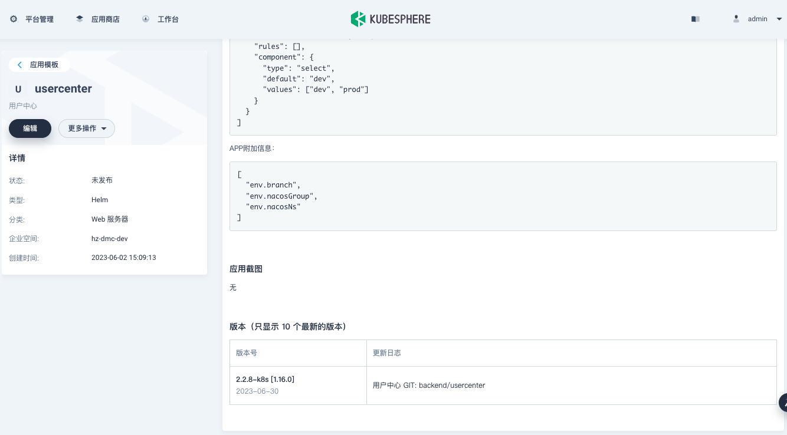
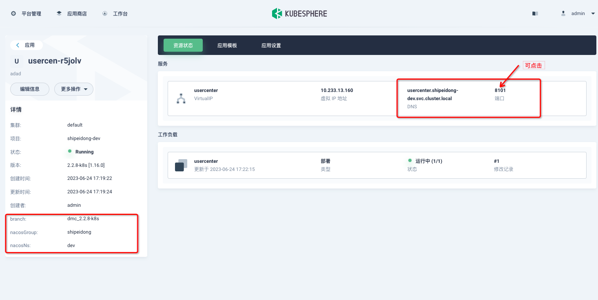

# KubeSphere Console

[](https://gitpod.io/#https://github.com/kubesphere/console)

[](https://www.gnu.org/licenses/agpl-3.0)

KubeSphere console is the web interface for [KubeSphere](https://github.com/kubesphere/kubesphere).


## Getting Started

Console should be always used with KubeSphere, you can either use [Kubekey](https://github.com/kubesphere/kubekey) or [ks-installer](https://github.com/kubesphere/ks-installer) to create a KubeSphere cluster.  
The following will show you how to build console from source code.


### Prerequisite
#### Node.js
Console is written using Javascript. If you don't have a Node.js development environment, please [set it up](https://nodejs.org/en/download/). The minimum version required is 12.18.

#### Yarn
We use [Yarn](https://yarnpkg.com/) to do package management. If you don't have yarn, use the following to install:
```
npm install -g yarn@1.22.4
```
The minimum version required is 1.22.4, but you can use a newer version.

#### [Optional]Docker
This is optional. If you just want to test and build on your local environment, there is no need to install docker. Otherwise, you need to install it.
[Install on Mac](https://docs.docker.com/desktop/mac/install/)
[Install on Windows](https://docs.docker.com/desktop/windows/install/)
[Install on Ubuntu](https://docs.docker.com/engine/install/ubuntu/)

#### [Optional]Make
This is optional too, we use `make` to reduce hand work, but it's totally ok without it.

## How to build

Clone the repository, and run `yarn && yarn build`
```sh
git clone https://github.com/kubesphere/console.git
cd console/
yarn && yarn build
npm run serve
```
> If you have trouble downloading the dependencies, try the following
>
> `yarn config set registry https://registry.npmmirror.com`


After `npm run serve`, you should see the output like the following

```
> kubesphere-console@master serve
> NODE_ENV=production node server/server.js

Dashboard app running at port 8000
```
Now, console is up and running. But since there is no backed KubeSphere cluster, you shouldn't be able to login.

## How to debug
A KubeSphere cluster is required to start debugging. You can refer to [Installation](https://github.com/kubesphere/kubesphere#installation) to create a KubeSphere cluster.

Once the cluster is up, you replace the address of `ks-apiserver` in `server/config.yaml` with your real address. You can refer to [access KubeSphere apiserver](docs/access-backend.md) to expose your cluster `ks-apiserver`.
```
  # backend service gateway server
  apiServer:
    clientID: kubesphere
    clientSecret: kubesphere
    url: http://ks-apiserver
    wsUrl: ws://ks-apiserver
```

## How to build container image

Just run the following command with your real `REPO` address.
```
REPO=yourawesomerepo make container
```

## How to submit a PR

Follow [Development Workflow](/docs/development-workflow.md) to commit your codes.

## Features Map:


## Support, Discussion, and Community

If you need any help with KubeSphere, please join us at [Slack Channel](https://join.slack.com/t/kubesphere/shared_invite/zt-1ilxbsp39-t4ES4xn5OI0eF5hvOoAhEw).

Please submit any KubeSphere Console bugs, issues, and feature requests to [KubeSphere Console GitHub Issue](https://github.com/kubesphere/console/issues).

## Contributing to the project

Welcome to contribute to KubeSphere Console, see [Contributing Guide](CONTRIBUTING.md).

The KubeSphere localization project has been launched on Crowdin. You can help localize the KubeSphere web console by referring to the [localization guide](docs/join-the-kubesphere-localization-project.md).

## Customized

### 定制化APP部署UI

可在应用的values.schema.json中配置相应信息，安装时会根据配置渲染UI

1. 增加支持选择框

```json
{
  "type": "string",
  "title": "配置中心Namespace",
  "form": true,
  "render": "select",
  "values": ["dev", "prod"]
}
```

2. 增加支持AutoComplete记忆功能，配置时可看到改配置最近5次的值

storePaths需配置两处

```json
{
  "$schema": "https://json-schema.org/draft-07/schema#",
  "type": "object",
  "properties": {
    "serviceEnv": {
      "type": "object",
      "title": "模块参数",
      "form": true,
      "properties": {
        "gitBranch": {
          "type": "string",
          "title": "Git分支",
          "form": true,
          "render": "latestAutoComplete",
          "storePath": "serviceEnv.gitBranch"
        }
      }
    }
  },
  "required": [
  ],
  "storePaths": [
    "serviceEnv.gitBranch"
  ]
}
```

3. 支持联动，当某一项变更时联动变化另一项
```json
{
  "$schema": "https://json-schema.org/draft-07/schema#",
  "type": "object",
  "properties": {
    "serviceEnv": {
      "type": "object",
      "title": "模块参数",
      "form": true,
      "properties": {
        "serviceName": {
          "type": "string",
          "title": "模块名",
          "form": true,
          "render": "select",
          "values": ["bdp-fe", "tassadar"],
          "linked": {
            "path": "serviceEnv.servicePort",
            "map": {
              "bdp-fe": "9987",
              "tassadar": "19987"
            }
          }
        },
        "servicePort": {
          "type": "string",
          "title": "端口",
          "form": true
        }
    }
  }
}
```


### 定制化APP附加信息

可在应用的列表页和详情页定制显示项，会从value.yaml中提取信息显示，格式为a.b.c提取yaml

1. 配置，必须严格按照图中配置，以“APP附加信息：”开头，同时放在json的代码块中

```json
[
  "env.branch",
  "env.nacosGroup",
  "env.nacosNs"
]
```

Tips：env.branch表示提取下面的branch
```yaml
env:
  branch: xxx
```



2. 列表页


3. 详情页



### 定制化菜单

可通过配置文件添加自定义菜单，iframe或者跳转链接

例子：

```yaml
client:
  externalMenu:
    - title: "配置中心"
      name: "config"
      type: "iframe"
      url: "http://console.nacos.io/nacos/index.html#/configurationManagement?dataId=&group=&appName=&namespace=&pageSize=&pageNo="
    - title: "前端联调"
      name: "test"
      type: "link"
      url: "http://dev.haizhi.com"
```

上面例子，添加了两个菜单“配置中心”、“前端联调”；
- “配置中心”为iframe内嵌，点击会打开相应的内嵌页面；
- “前端联调”为跳转链接，点击会打开新的tab，跳转到相应的页面


### 其他个性化

个性化站点名称、描述、logo

```yaml
client:
  title: "海致开发运维管理平台"
  description: "海致精心打造的开发运维管理平台"
  logo: "/assets/hz-logo.png"
```


